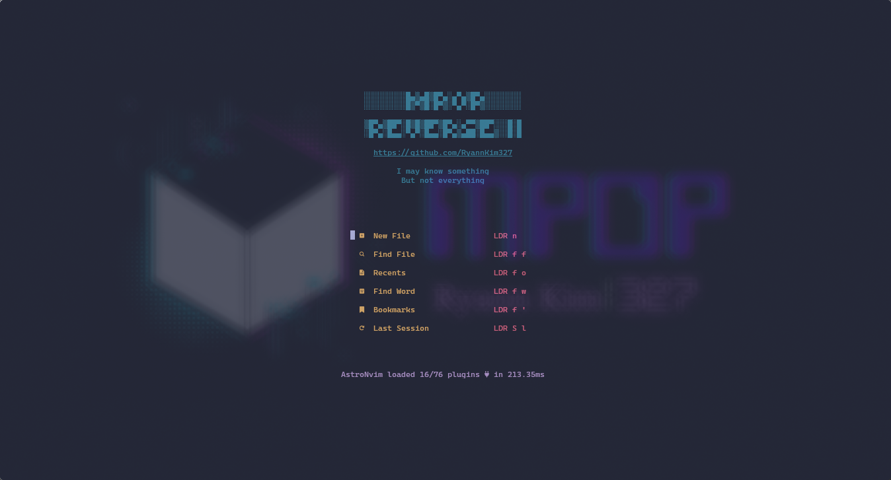
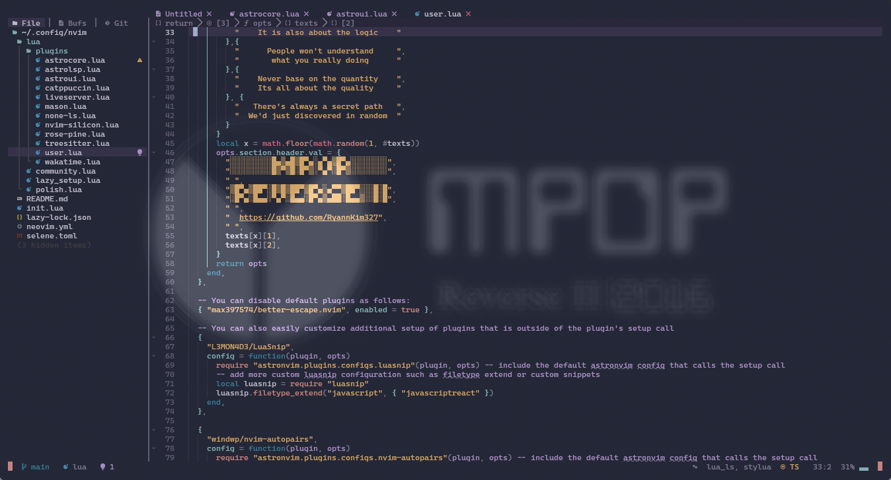

### AstroNvim Template [Modified]
#### MPOP Reverse II with AstroVIM and itsmenewbie03

---
### Current Interface



**NOTE:** This is for AstroNvim v4+

A template for getting started with [AstroNvim](https://github.com/AstroNvim/AstroNvim)

## 🛠️ Installation

#### Make a backup of your current nvim and shared folder

```shell
mv ~/.config/nvim ~/.config/nvim.bak
mv ~/.local/share/nvim ~/.local/share/nvim.bak
mv ~/.local/state/nvim ~/.local/state/nvim.bak
mv ~/.cache/nvim ~/.cache/nvim.bak
```

#### Create a new user repository from this template

Press the "Use this template" button above to create a new repository to store your user configuration.

You can also just clone this repository directly if you do not want to track your user configuration in GitHub.

#### Clone the repository

```shell
git clone https://github.com/<your_user>/<your_repository> ~/.config/nvim
```

#### Clone my template
```shell
git clone https://github.com/RyannKim327/astrovim-v4-template ~/.config/nvim
```

#### To Update the repository
```shell
cd ~/.config/nvim
git pull
```

#### Start Neovim

```shell
nvim
```

---
### Termux Configuration
1. Download and install Termux from [FDroid](https://f-droid.org/en/packages/com.termux/)
2. Grant Permission executing `termux-setup-storage` or to manually granting it through your android settings
3. Install neovim using `pkg install neovim`
4. If you already have the configurations aside of AstroVIM, you may create backup using [This method](#Make-a-backup-of-your-current-nvim-and-shared-folder) 
5. Then clone this [repository](#clone-my-template)
6. Then you may now execute `nvim` into your termux, and wait until the downloading process finished. Expect that there are some errors in downloads, but it still works.

---
### Windows NVIM Setup
1. Install Neovim from the [source](https://neovim.io)
2. Clone this repository using git, and copy all the files inside of the folder `astrovim-v4-template`
3. Next is to go in your nvim directory `C:\Users\PC\AppData\Local` and look for `nvim` folder
4. If the folder is not exists, kindly create a file `nvim` the `nvim-data` is not we are looking for, its different.
5. Open the folder `nvim` and paste the copied files inside.
6. Test if it works by executing `nvim` into your terminal.

---
### Credits
* AstroVIM
* Salvador [itsmenewbie03]
